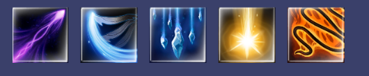
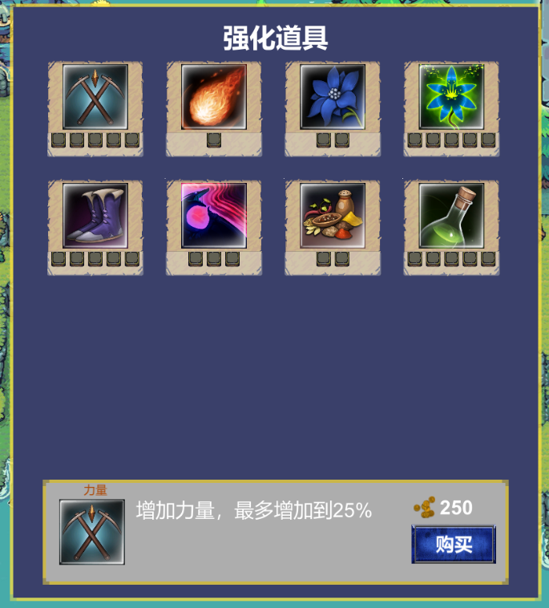
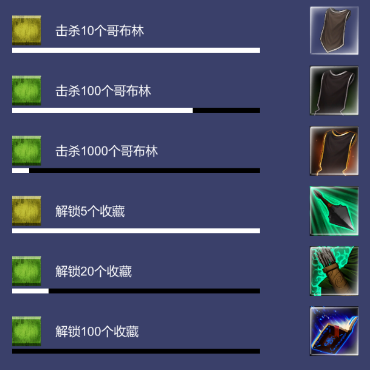
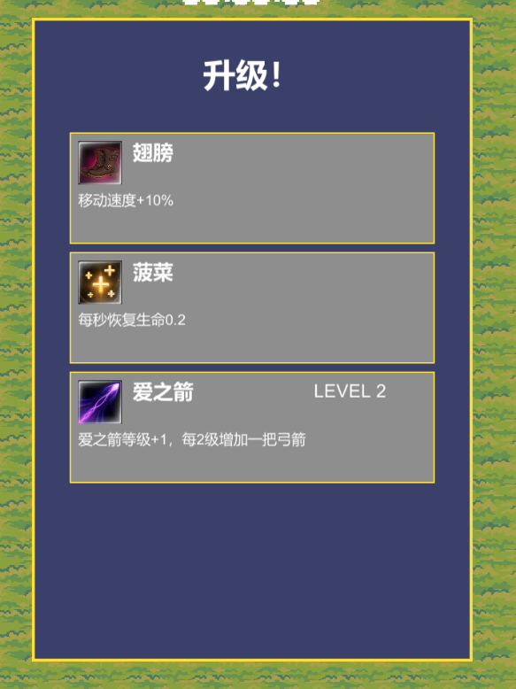
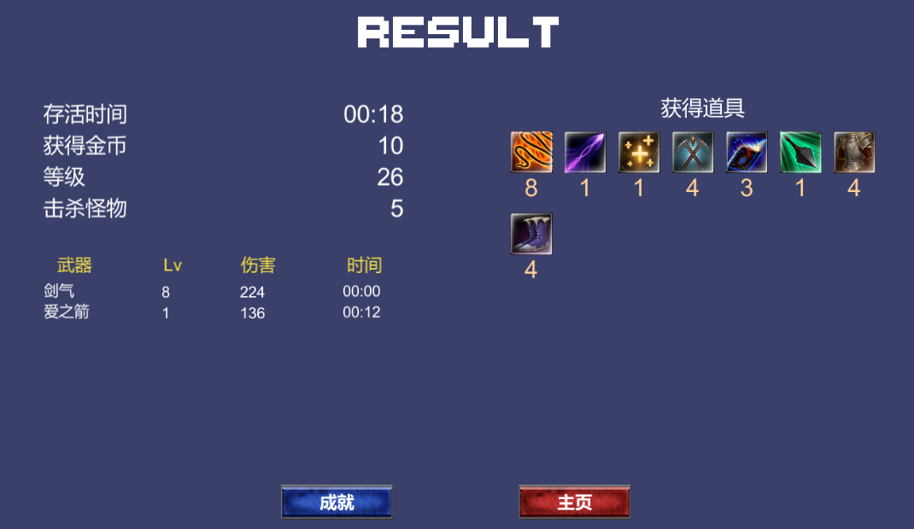
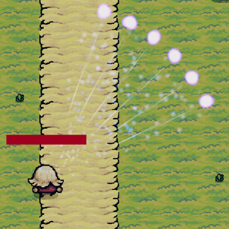
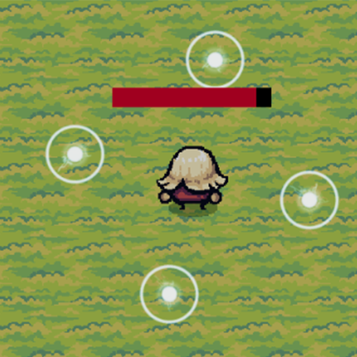
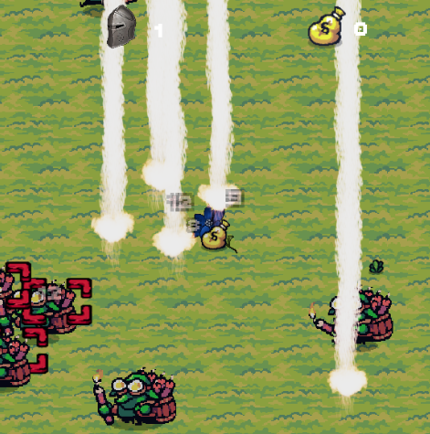
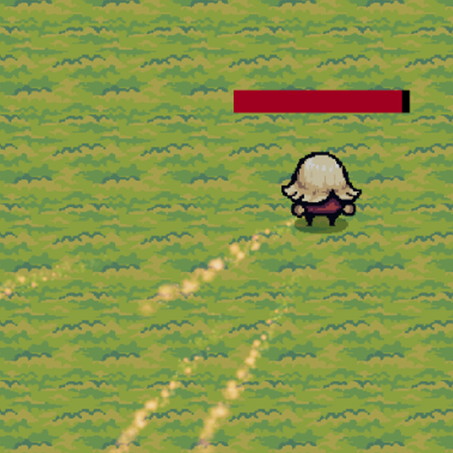
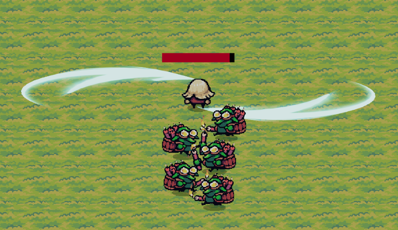

# 吸血鬼幸存者类游戏 练习Demo

一个模仿《吸血鬼幸存者》玩法的 2D 生存类游戏，使用 Unity 2020.3 开发。

## 游戏玩法

- 玩家自动攻击，只需要移动角色躲避敌人
- 击败敌人获得经验，升级后可以选择新的技能

## 操作说明
- WASD移动和鼠标点击即可。
- ESC键暂停，TAB键可以随时查看角色属性
  
## 开发环境
- Unity 2020.3.48f1c1
- Visual Studio 2022

## 资源说明
- 项目实现了选人，成就，收藏，强化功能。
- 现有DATA为5个基础角色，5把武器，7个强化技能，1张地图，10个被动技能，6个成就。
- 美术资源都是从unity商城下载的免费资源。

- 进入游戏时可以顺利升级选事件（3选1面板），增加角色强度。

- 游戏失败时进入结算面板，可以看到本局的选择详情。

### 武器展示
| 弓箭 | 环绕物 | 激光 | 火球 | 剑气 |
| :---: | :---: | :---: | :---: | :---: |
|  |  |  |  |  |

